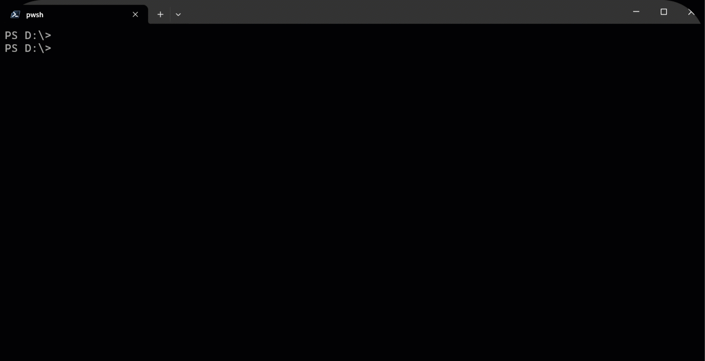

# PShell-AI



> "Ten minutes of Googling is now ten seconds in the terminal."
>
> ~ John D.

## About
For developers, referencing things online is inevitable – but one can only look up "how to do [X] in docker or git" so many times before losing your mind.

## Install
```powershell
Install-Module PShell-AI
```

## Usage

### Configuration

Set your [OpenAI API key](https://platform.openai.com/api-keys).

> **Note**: Make sure you add credits to your account. Otherwise you only get back blank responses.

```powershell
$env:OpenAIKey='[your-key]'
```

## Features

- Generate shell commands from a description.
- Reference code snippets for any programming language.
- Fast, minimal UI.
- Auto-extract code from response and copy to clipboard.
- Follow up to refine command or explanation.
- Concise, helpful responses.
<!-- - Fast, syntax-highlighted, minimal UI. -->
<!-- - Support for [other providers and open source models](#custom-model-configuration-new)! -->


# Enhanced Display

If you install `PwshSpectreConsole` you will get a better display of the responses.

```powershell
Install-Module PwshSpectreConsole
```


## Examples

### Shell Commands

```powershell
q make a new git branch
```

```powershell
git branch new-branch
```

```powershell
q find files that contain "administrative" in the name
```

```powershell
Get-ChildItem -Path "C:\Path\To\Search" -Filter "*administrative*" -Recurse
```

### Code Snippets

```powershell
q initialize a static map in golang
```

```powershell
    staticMap := map[string]int{
        "apple":  1,
        "banana": 2,
        "cherry": 3,
    }
```

```powershell
q greet fn in PowerShell
```

```powershell
function Greet {
    param (
        [string]$Name = "Guest"
    )
    Write-Host "Hello, $Name! Welcome to PowerShell!"
}
```

```powershell
q create a generator function in python for dates
```

```python
from datetime import datetime, timedelta

def date_generator(start_date, end_date):
    current_date = start_date
    while current_date <= end_date:
        yield current_date
        current_date += timedelta(days=1)
```